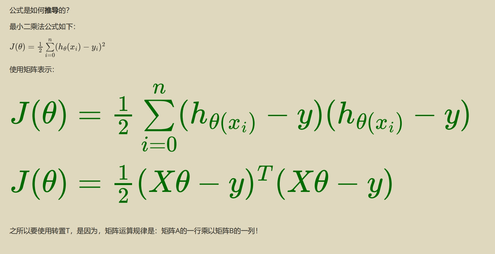

上面公式转置是什么意思，为什么可以转置。再用具体数值举个例子说明

上面公式的转置部分是在推导最小二乘法中的**代价函数**时，为了将向量和矩阵乘法写得更加紧凑和清晰。具体转置的含义以及如何进行矩阵乘法，可以从以下几个角度理解：

### 1. 公式含义

- 初始公式 \( J(\theta) = \frac{1}{2} \sum_{i=0}^{n} (h_\theta(x_i) - y_i)^2 \) 是**代价函数**，表示线性回归中预测值和真实值之间的误差平方和。
  
  其中：
  - \( h_\theta(x_i) \) 是预测值
  - \( y_i \) 是真实值

- 当公式写成矩阵形式时，表达式为：
  \[
  J(\theta) = \frac{1}{2} (X\theta - y)^T (X\theta - y)
  \]
  这里的 \( X\theta - y \) 是向量，表示预测值和真实值的差异，带有 \( T \) 表示转置操作。

### 2. 为什么要使用转置

- **矩阵乘法规则**：矩阵运算的一个基本规则是，当两个向量（或矩阵）相乘时，它们的**维度必须匹配**。比如：
  - \( a^T \cdot b \) 意味着行向量 \( a^T \) 乘以列向量 \( b \)，这样才符合乘法规则。
  - 如果不进行转置，乘法操作在形式上无法进行，因此需要通过转置使其符合矩阵乘法的维度要求。

### 3. 具体例子

假设有：

- \( X = \begin{bmatrix} 1 & 2 \\ 3 & 4 \\ \end{bmatrix} \)
- \( \theta = \begin{bmatrix} 1 \\ 2 \\ \end{bmatrix} \)
- \( y = \begin{bmatrix} 1 \\ 1 \\ \end{bmatrix} \)

  首先计算 \( X\theta \)：
  \[
  X\theta = \begin{bmatrix} 1 & 2 \\ 3 & 4 \\ \end{bmatrix} \begin{bmatrix} 1 \\ 2 \\ \end{bmatrix} = \begin{bmatrix} 1 \times 1 + 2 \times 2 \\ 3 \times 1 + 4 \times 2 \\ \end{bmatrix} = \begin{bmatrix} 5 \\ 11 \\ \end{bmatrix}
  \]

  接下来，计算 \( X\theta - y \)：
  \[
  X\theta - y = \begin{bmatrix} 5 \\ 11 \\ \end{bmatrix} - \begin{bmatrix} 1 \\ 1 \\ \end{bmatrix} = \begin{bmatrix} 4 \\ 10 \\ \end{bmatrix}
  \]

  再计算转置后的 \( (X\theta - y)^T \)：
  \[
  (X\theta - y)^T = \begin{bmatrix} 4 \\ 10 \\ \end{bmatrix}^T = \begin{bmatrix} 4 & 10 \\ \end{bmatrix}
  \]

  最后，计算 \( (X\theta - y)^T (X\theta - y) \)：
  \[
  (X\theta - y)^T (X\theta - y) = \begin{bmatrix} 4 & 10 \\ \end{bmatrix} \begin{bmatrix} 4 \\ 10 \\ \end{bmatrix} = 4 \times 4 + 10 \times 10 = 16 + 100 = 116
  \]

因此，代价函数 \( J(\theta) \) 对应的值为：
\[
J(\theta) = \frac{1}{2} \times 116 = 58
\]

### 总结

转置是为了满足矩阵运算的规则，同时使公式更加简洁和易于理解。
