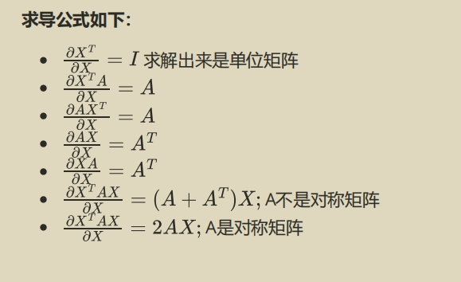

图片中给出的求导公式涉及矩阵的导数推导，主要用于机器学习中的优化过程。每个公式的推导都有其特定的背景，下面我将详细解释每个公式的推导过程，并给出数值例子。

### 1. \( \frac{\partial X^T}{\partial X} = I \)

这是一个常见的矩阵微分结果，其中 \( X \) 是一个向量或者矩阵，\( I \) 是单位矩阵。

#### 推导

假设 \( X \) 是 \( n \times 1 \) 的列向量，\( X^T \) 是行向量。求导的含义是：对于 \( X^T \) 中的每个元素对 \( X \) 求偏导，结果就是单位矩阵。

#### 数值例子

若 \( X = \begin{bmatrix} x_1 \\ x_2 \end{bmatrix} \)，则 \( X^T = \begin{bmatrix} x_1 & x_2 \end{bmatrix} \)，
求导后：
\[
\frac{\partial X^T}{\partial X} = \begin{bmatrix} 1 & 0 \\ 0 & 1 \end{bmatrix} = I
\]

### 2. \( \frac{\partial X^T A}{\partial X} = A \)

这里的 \( A \) 是一个矩阵，\( X \) 是一个向量。这个公式表示，矩阵和向量乘积的导数结果与矩阵本身有关。

#### 推导

假设 \( X \) 是 \( n \times 1 \) 向量，\( A \) 是 \( n \times n \) 矩阵，\( X^T A \) 是标量。当对 \( X \) 求导时，结果是矩阵 \( A \)。

#### 数值例子

若 \( A = \begin{bmatrix} 1 & 2 \\ 3 & 4 \end{bmatrix}, X = \begin{bmatrix} x_1 \\ x_2 \end{bmatrix} \)，则：
\[
X^T A = \begin{bmatrix} x_1 & x_2 \end{bmatrix} \begin{bmatrix} 1 & 2 \\ 3 & 4 \end{bmatrix} = x_1(1) + x_2(3) = 1x_1 + 3x_2
\]
对 \( X \) 求导，结果就是矩阵 \( A \)。

### 3. \( \frac{\partial A X^T}{\partial X} = A \)

这个公式与上一个类似，但这里 \( X \) 的位置发生了变化，推导结果依然是矩阵 \( A \)。

#### 推导

同样地，假设 \( X \) 是 \( n \times 1 \) 向量，\( A \) 是 \( n \times n \) 矩阵，公式 \( AX^T \) 是一个矩阵，结果依然是矩阵 \( A \)。

#### 数值例子

若 \( A = \begin{bmatrix} 1 & 2 \\ 3 & 4 \end{bmatrix}, X = \begin{bmatrix} x_1 \\ x_2 \end{bmatrix} \)，
\[
A X^T = \begin{bmatrix} 1 & 2 \\ 3 & 4 \end{bmatrix} \begin{bmatrix} x_1 & x_2 \end{bmatrix}
\]
求导结果仍为 \( A \)。

### 4. \( \frac{\partial AX}{\partial X} = A^T \)

当矩阵 \( A \) 与向量 \( X \) 相乘时，导数的结果是矩阵 \( A \) 的转置 \( A^T \)。

#### 推导

矩阵 \( AX \) 是一个向量，因此，求导时结果会是一个与矩阵 \( A \) 有关的表达式。最终的推导结果是矩阵 \( A \) 的转置。

#### 数值例子

设 \( A = \begin{bmatrix} 1 & 2 \\ 3 & 4 \end{bmatrix}, X = \begin{bmatrix} x_1 \\ x_2 \end{bmatrix} \)，
\[
AX = \begin{bmatrix} 1 & 2 \\ 3 & 4 \end{bmatrix} \begin{bmatrix} x_1 \\ x_2 \end{bmatrix} = \begin{bmatrix} 1x_1 + 2x_2 \\ 3x_1 + 4x_2 \end{bmatrix}
\]
对 \( X \) 求导后，结果为 \( A^T = \begin{bmatrix} 1 & 3 \\ 2 & 4 \end{bmatrix} \)。

### 5. \( \frac{\partial X^T A X}{\partial X} = (A + A^T)X \)

这是矩阵微分的一个常见结果，用于二次型函数的求导。它说明当矩阵不是对称矩阵时，导数结果与矩阵的转置有关。

#### 推导

当对 \( X^T A X \) 求导时，结果是 \( A + A^T \)，然后乘以 \( X \)。

#### 数值例子

假设 \( A = \begin{bmatrix} 1 & 2 \\ 3 & 4 \end{bmatrix}, X = \begin{bmatrix} x_1 \\ x_2 \end{bmatrix} \)，
\[
X^T A X = \begin{bmatrix} x_1 & x_2 \end{bmatrix} \begin{bmatrix} 1 & 2 \\ 3 & 4 \end{bmatrix} \begin{bmatrix} x_1 \\ x_2 \end{bmatrix} = 1x_1^2 + 4x_1x_2 + 4x_2^2
\]
对 \( X \) 求导，结果为：
\[
(A + A^T)X = \begin{bmatrix} 1 & 3 \\ 2 & 4 \end{bmatrix} \begin{bmatrix} x_1 \\ x_2 \end{bmatrix}
\]

### 6. \( \frac{\partial X^T A X}{\partial X} = 2AX \)

当 \( A \) 是对称矩阵时（即 \( A = A^T \)），导数会简化为 \( 2AX \)。

#### 推导

对于对称矩阵 \( A \)，\( A + A^T = 2A \)，因此最终的结果是 \( 2AX \)。

#### 数值例子

设 \( A = \begin{bmatrix} 1 & 2 \\ 2 & 3 \end{bmatrix}, X = \begin{bmatrix} x_1 \\ x_2 \end{bmatrix} \)，
\[
X^T A X = \begin{bmatrix} x_1 & x_2 \end{bmatrix} \begin{bmatrix} 1 & 2 \\ 2 & 3 \end{bmatrix} \begin{bmatrix} x_1 \\ x_2 \end{bmatrix} = 1x_1^2 + 4x_1x_2 + 3x_2^2
\]
对 \( X \) 求导，结果为 \( 2AX \)。

---

这些矩阵导数公式在机器学习优化问题中非常常用，特别是在二次损失函数或者正则化项的求解过程中。
