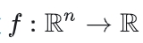
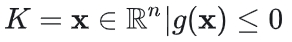

$f:\mathbb{R}^n\to\mathbb{R}$表示一个函数$f$，它将$n$维实数空间$\mathbb{R}^n$中的元素映射到实数集$\mathbb{R}$中。

以下是几个不同的例子：

**例一：二维空间到实数的函数**
当$n = 2$时，比如$f(x,y)=\sqrt{x^2 + y^2}$。这里函数$f$的输入是一个二维向量$(x,y)\in\mathbb{R}^2$，它表示平面上的一个点。函数的输出是这个点到原点的距离，是一个实数，属于$\mathbb{R}$。

**例二：三维空间到实数的函数**
当$n = 3$时，设$f(x,y,z)=x + y + z$。输入是一个三维向量$(x,y,z)\in\mathbb{R}^3$，函数计算三个坐标值的和，输出一个实数。

**例三：高维空间到实数的函数**
当$n = 5$时，比如$f(x_1,x_2,x_3,x_4,x_5)=x_1^2 + 2x_2 - 3x_3 + x_4x_5$。输入是一个五维向量$(x_1,x_2,x_3,x_4,x_5)\in\mathbb{R}^5$，函数通过对各个坐标进行特定的运算得到一个实数输出。

$K=\{x\in\mathbb{R}^n|g(x)\leq0\}$表示一个集合$K$，其中的元素是$n$维实数空间$\mathbb{R}^n$中的向量$x$，并且这些向量满足条件$g(x)\leq0$。

以下是几个不同的例子：

**例一：二维空间的例子**
当$n = 2$时，设$g(x,y)=x^2 + y^2 - 1$。
那么集合$K=\{(x,y)\in\mathbb{R}^2|x^2 + y^2 - 1\leq0\}$表示平面上以原点为圆心，半径为 1 的圆及其内部的点的集合。

**例二：三维空间的例子**
当$n = 3$时，设$g(x,y,z)=x^2 + y^2 + z^2 - 4$。
集合$K=\{(x,y,z)\in\mathbb{R}^3|x^2 + y^2 + z^2 - 4\leq0\}$表示空间中以原点为球心，半径为 2 的球及其内部的点的集合。

**例三：高维空间的简单例子**
当$n = 4$时，设$g(x_1,x_2,x_3,x_4)=x_1 + x_2 + x_3 + x_4 - 5$。
集合$K=\{(x_1,x_2,x_3,x_4)\in\mathbb{R}^4|x_1 + x_2 + x_3 + x_4 - 5\leq0\}$表示四维空间中满足四个坐标之和小于等于 5 的点的集合。
