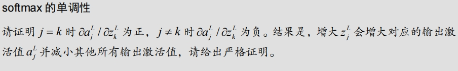

解释这个softmax这个理论，并用数值举例
这个问题是关于 **softmax 函数** 的单调性，主要讨论了在 softmax 输出的激活值 \( a_j^l \) 对应的输入 \( z_j^l \) 变化时的影响。

### 解释

1. **Softmax 函数**：给定一个输入向量 \( z = [z_1, z_2, \dots, z_n] \)，softmax 函数将其转换为概率分布 \( a = [a_1, a_2, \dots, a_n] \)，其中每个元素的值都在 \( 0 \) 到 \( 1 \) 之间，并且所有元素之和为 \( 1 \)。公式为：

   \[
   a_j = \frac{e^{z_j}}{\sum_{k=1}^{n} e^{z_k}}
   \]

2. **梯度性质**：题目要求证明 softmax 激活值 \( a_j^l \) 对应的输入 \( z_j^l \) 的导数是正的，即 \( \frac{\partial a_j^l}{\partial z_j^l} > 0 \)，而对 \( z_k^l \) (\( k \neq j \)) 的导数是负的，即 \( \frac{\partial a_j^l}{\partial z_k^l} < 0 \)。

   - 当 \( j = k \) 时，增加 \( z_j^l \) 会增加对应的激活值 \( a_j^l \)。
   - 当 \( j \neq k \) 时，增加 \( z_j^l \) 会减少其他激活值 \( a_k^l \)。

### 数值举例

假设我们有一个三维输入向量 \( z = [z_1, z_2, z_3] = [1, 2, 3] \)，我们计算其对应的 softmax 激活值。

1. 计算每个 \( z_i \) 的指数值：
   \[
   e^{z_1} = e^1 \approx 2.718, \quad e^{z_2} = e^2 \approx 7.389, \quad e^{z_3} = e^3 \approx 20.085
   \]

2. 计算指数值的总和：
   \[
   \sum_{i=1}^{3} e^{z_i} \approx 2.718 + 7.389 + 20.085 = 30.192
   \]

3. 计算每个激活值 \( a_j \)：
   \[
   a_1 = \frac{2.718}{30.192} \approx 0.09, \quad a_2 = \frac{7.389}{30.192} \approx 0.245, \quad a_3 = \frac{20.085}{30.192} \approx 0.665
   \]

可以看出，softmax 的输出会更倾向于较大的 \( z_3 \)，因为 \( z_3 = 3 \) 是输入向量中最大的值。进一步，如果我们增大 \( z_3 \)，则 \( a_3 \) 会增加，而其他 \( a_1 \) 和 \( a_2 \) 会减小，这符合 softmax 的单调性特点。

##  _____________________________________________
在这里单调性特点是指什么特点？
在数学和机器学习中，**单调性** 指的是某个函数的输出随输入的变化呈现出单调递增或单调递减的关系。

### 对于 Softmax 函数的单调性

1. **单调递增**：对于某个输入 \( z_j \) 对应的输出 \( a_j \)，如果增加 \( z_j \)，则 \( a_j \) 也会增加。这意味着当我们增加某个输入的值时，对应的 Softmax 输出值会增大。数学上，这可以表示为：
   \[
   \frac{\partial a_j}{\partial z_j} > 0
   \]
   这表明当 \( z_j \) 增大时，对应的 \( a_j \) 也增大。

2. **单调递减**：对于其他不等于 \( j \) 的输入 \( z_k \)（即 \( k \neq j \)），如果增加 \( z_j \)，则对应的其他输出 \( a_k \) 会减小。数学上，这可以表示为：
   \[
   \frac{\partial a_k}{\partial z_j} < 0 \quad \text{for } k \neq j
   \]
   这表明当某个 \( z_j \) 增大时，其他不对应的激活值 \( a_k \) 会减小。

### 简单总结

- **单调递增**：当你增加某个输入 \( z_j \) 时，Softmax 函数的对应输出 \( a_j \) 也会增加。
- **单调递减**：当你增加某个输入 \( z_j \) 时，Softmax 函数的其他输出 \( a_k \) 会减小。

这个单调性的特点保证了 Softmax 函数能够将较大的输入值对应到更大的输出概率，从而起到突显某个类别的作用。
