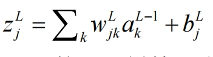

解释这个公式各个字母

这个公式描述了神经网络中的某一层（第L层）中的单元（或神经元）\(z_j^L\)的线性组合。公式的各个符号的含义如下：

- \(z_j^L\)：第L层中第j个神经元的加权输入（有时称为“预激活值”）。
- \(\sum_k\)：求和符号，表示对前一层的所有神经元的加权和进行求和。
- \(w_{jk}^L\)：权重参数，表示从前一层（第L-1层）中第k个神经元到第L层中第j个神经元的连接权重。它决定了输入特征在此神经元中的重要性。
- \(a_k^{L-1}\)：前一层（第L-1层）中第k个神经元的激活值。这是通过激活函数作用在前一层的加权和上的输出。
- \(b_j^L\)：第L层中第j个神经元的偏置项。它是一个用于调节神经元输出的额外参数，帮助模型更好地拟合数据。

这个公式可以总结为：**当前层中某个神经元的输入值是前一层中所有神经元的激活值和连接它们的权重的加权和，再加上一个偏置项**。
## _______________________
###  k的取值范围是多少，是对前一层的所有神经元进行加权求和么?
是的，符号 \(k\) 的取值范围是前一层（第 \(L-1\) 层）中所有神经元的索引。这意味着公式中的求和操作 \(\sum_k\) 涉及前一层中的每一个神经元。

具体来说，如果第 \(L-1\) 层有 \(n_{L-1}\) 个神经元，那么 \(k\) 的取值范围就是 \(1, 2, \dots, n_{L-1}\)，即从第1个神经元一直到第 \(n_{L-1}\) 个神经元。公式中的求和操作就是对这些所有神经元的激活值和对应的权重进行加权求和。

总结来说，\(k\) 取的是前一层中所有神经元的索引，因此，这个公式是对前一层的所有神经元进行加权求和。

http://neuralnetworksanddeeplearning.com/chap3.html