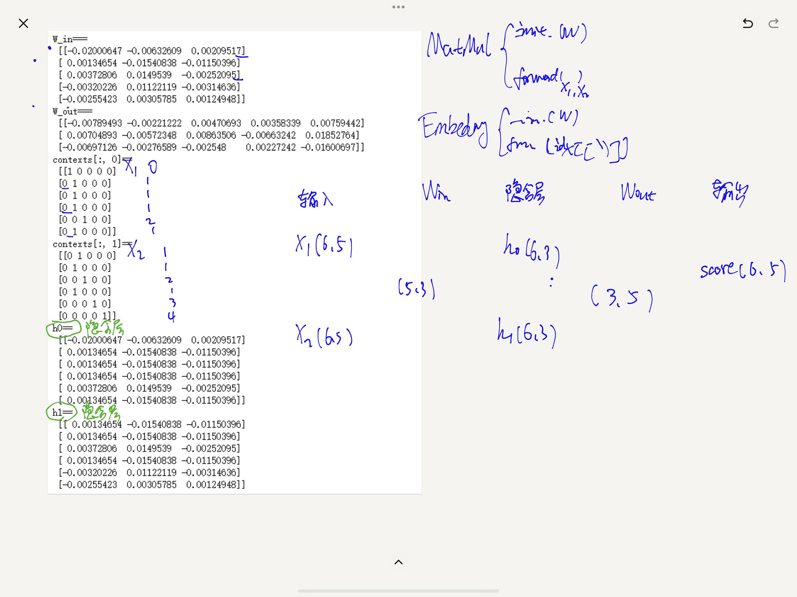

contexts = np.array([[[1, 0, 0, 0, 0], [0, 1, 0, 0, 0]],
                     [[0, 1, 0, 0, 0], [0, 1, 0, 0, 0]],
                     [[0, 1, 0, 0, 0], [0, 0, 1, 0, 0]],
                     [[0, 1, 0, 0, 0], [0, 1, 0, 0, 0]],
                     [[0, 0, 1, 0, 0], [0, 0, 0, 1, 0]],
                     [[0, 1, 0, 0, 0], [0, 0, 0, 0, 1]]])
contexts[:, 0]这个是什么意思

`contexts[:, 0]` 是一个对 `contexts` 数组的切片操作，它的意思是：

- `contexts` 是一个三维数组，形状为 `(6, 2, 5)`，表示 6 个样本，每个样本包含 2 个时间步（即 2 行），每个时间步有 5 个特征。
  
- `contexts[:, 0]` 的切片操作中：
  - `:` 表示选择所有的样本（即所有的第一维元素），
  - `0` 表示选择每个样本中的第一个时间步（即每个样本的第一行）。

### 具体含义：
`contexts[:, 0]` 选取了 `contexts` 数组中的每个样本的第一个时间步（即每个样本的第一行）。

### 示例：
假设 `contexts` 如下所示：
```python
contexts = np.array([[[1, 0, 0, 0, 0], [0, 1, 0, 0, 0]],
                     [[0, 1, 0, 0, 0], [0, 1, 0, 0, 0]],
                     [[0, 1, 0, 0, 0], [0, 0, 1, 0, 0]],
                     [[0, 1, 0, 0, 0], [0, 1, 0, 0, 0]],
                     [[0, 0, 1, 0, 0], [0, 0, 0, 1, 0]],
                     [[0, 1, 0, 0, 0], [0, 0, 0, 0, 1]]])
```

`contexts[:, 0]` 会选取每个样本的第一行：

```python
contexts[:, 0] = [[1, 0, 0, 0, 0],  # 第一个样本的第一个时间步
                  [0, 1, 0, 0, 0],  # 第二个样本的第一个时间步
                  [0, 1, 0, 0, 0],  # 第三个样本的第一个时间步
                  [0, 1, 0, 0, 0],  # 第四个样本的第一个时间步
                  [0, 0, 1, 0, 0],  # 第五个样本的第一个时间步
                  [0, 1, 0, 0, 0]]  # 第六个样本的第一个时间步
```

它的形状将是 `(6, 5)`，即 6 个样本的第一行。

### 如果用代码展示：
```python
print(contexts[:, 0])
```

输出：
```python
[[1 0 0 0 0]
 [0 1 0 0 0]
 [0 1 0 0 0]
 [0 1 0 0 0]
 [0 0 1 0 0]
 [0 1 0 0 0]]
```

### 总结：
`contexts[:, 0]` 获取的是 `contexts` 中每个样本的第一个时间步（即每个样本的第一行）。

其实也不用时间步来解释，你就理解成所有行的第一个元素