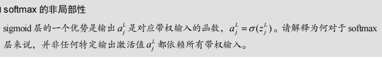

Softmax 和 sigmoid 是两种不同的激活函数，常用于不同的神经网络层中。它们在处理输入和输出的方式上有显著的区别，这也导致了它们在某些应用中的优劣。

### Sigmoid 激活函数

对于 sigmoid 激活函数，输出 \( a_j^L \) 是对应带权输入 \( z_j^L \) 的函数：
\[ a_j^L = \sigma(z_j^L) \]
其中，\[ \sigma(z) = \frac{1}{1 + e^{-z}} \]

这意味着每个输出激活值 \( a_j^L \) 只依赖于其对应的带权输入 \( z_j^L \)。这种依赖关系是局部的，因为 \( a_j^L \) 仅由 \( z_j^L \) 决定，与其他神经元的带权输入无关。

### Softmax 激活函数

对于 softmax 激活函数，输出 \( a_j^L \) 是所有带权输入 \( z_i^L \) 的函数：
\[ a_j^L = \frac{e^{z_j^L}}{\sum_{i} e^{z_i^L}} \]

这里的 \( a_j^L \) 不再是单独依赖于 \( z_j^L \)，而是依赖于所有的带权输入 \( z_i^L \)。这意味着 softmax 层的输出是非局部的，每个输出激活值都受到所有输入值的影响。

### 非局部性的含义

非局部性意味着在 softmax 层中，一个特定输出激活值 \( a_j^L \) 并不只是由对应的带权输入 \( z_j^L \) 决定，而是由所有带权输入的综合影响决定。这有以下几个重要的含义：

1. **归一化**：softmax 的输出是归一化的概率分布，所有输出值之和为 1。这种归一化特性使得 softmax 特别适合用于分类任务的最后一层，因为它提供了对每个类的概率估计。

2. **互相依赖**：每个输出激活值 \( a_j^L \) 依赖于所有输入 \( z_i^L \)，意味着如果一个输入值 \( z_i^L \) 改变了，它可能会影响到所有的输出 \( a_j^L \)。

3. **竞争机制**：由于输出值是归一化的，如果一个 \( z_j^L \) 非常大，它会导致 \( a_j^L \) 接近 1，而其他的 \( a_i^L \)（\( i \neq j \)）接近 0，这表现出一种“胜者为王”的竞争机制。

### 总结

sigmoid 层的优势在于其输出是局部决定的，每个输出激活值仅依赖于其对应的带权输入。而 softmax 层的特点是非局部性，每个输出激活值依赖于所有的带权输入。这种非局部性使得 softmax 特别适合用于需要概率分布的场景，比如分类任务的输出层。
