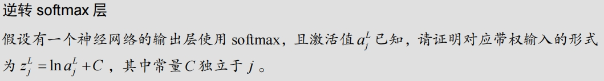

为了证明在使用 softmax 作为激活函数的情况下，已知输出激活值 \( a_j^L \) 可以得到对应的带权输入 \( z_j^L \) 的形式为 \( z_j^L = \ln a_j^L + C \)，其中常量 \( C \) 独立于 \( j \)，我们可以按照以下步骤进行推导：

### Softmax 函数定义

首先，回顾 softmax 函数的定义：

\[ a_j^L = \frac{e^{z_j^L}}{\sum_{i} e^{z_i^L}} \]

### 取对数

为了简化这个公式，我们取对数：

\[ \ln a_j^L = \ln \left( \frac{e^{z_j^L}}{\sum_{i} e^{z_i^L}} \right) \]

利用对数的性质，可以将右边的分数拆开：

\[ \ln a_j^L = \ln e^{z_j^L} - \ln \left( \sum_{i} e^{z_i^L} \right) \]

进一步简化得到：

\[ \ln a_j^L = z_j^L - \ln \left( \sum_{i} e^{z_i^L} \right) \]

### 常量 \( C \)

注意到 \(\ln \left( \sum_{i} e^{z_i^L} \right)\) 是一个常数，与 \( j \) 无关，因此我们可以写成：

\[ z_j^L = \ln a_j^L + C \]

其中 \( C = \ln \left( \sum_{i} e^{z_i^L} \right) \) 是一个常数，独立于 \( j \)。

### 总结

我们已经证明了，对于已知的 softmax 输出激活值 \( a_j^L \)，对应的带权输入 \( z_j^L \) 的形式为：

\[ z_j^L = \ln a_j^L + C \]

其中，常量 \( C \) 是独立于 \( j \) 的，并且其具体值为 \( C = \ln \left( \sum_{i} e^{z_i^L} \right) \)。
